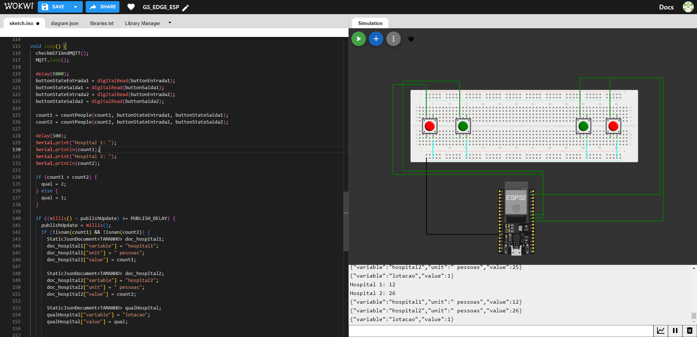
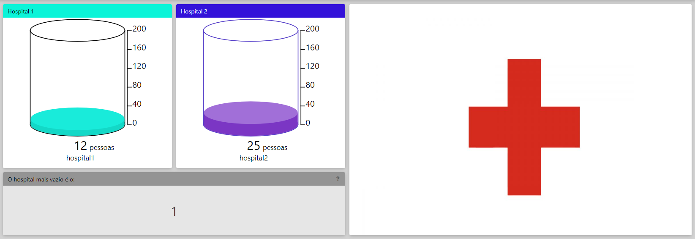
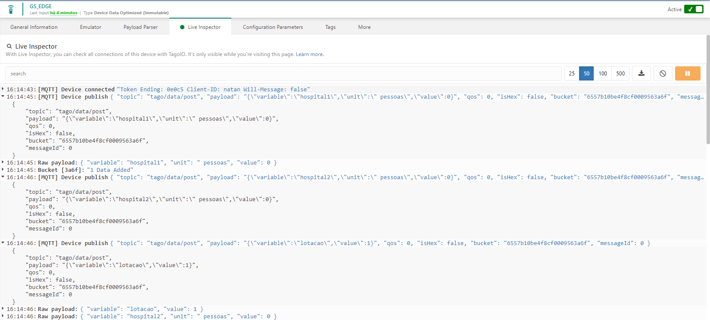
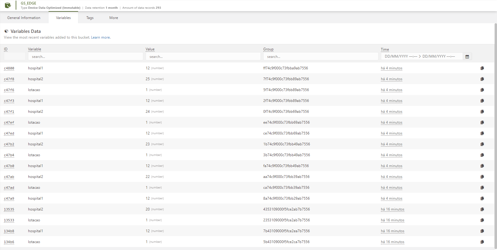

<h1 align="center">MedMaps - Global Solution - Edge</h1>
 
 
 
 
  
## :link: `Links`
* Youtube: https://youtu.be/v5ge7pYHw2A
   
* Wokwi: https://wokwi.com/projects/381664458690127873

## :memo: `Descrição do problema`

* A superlotação hospitalar resulta da imprevisibilidade na demanda por serviços de saúde, levando a picos repentinos de pacientes que sobrecarregam os recursos disponíveis. Isso causa distribuição inadequada de leitos, escassez de pessoal e congestionamento nas áreas de atendimento, impactando negativamente a qualidade e eficiência do cuidado médico. A falta de planejamento e estratégias preventivas agrava a situação, resultando em problemas de fluxo de pacientes e na dificuldade em lidar com emergências médicas de forma ágil e eficaz.

## :bulb: `Solução proposta`

* Nossa solução é um aplicativo inovador que permite aos usuários verificar a lotação dos hospitais em tempo real dentro de um determinado raio. Utilizando tecnologias de geolocalização, oferecemos informações detalhadas sobre a disponibilidade de leitos, ocupação e tempo de espera, capacitando os usuários a tomar decisões informadas sobre cuidados de saúde emergenciais ou planejados. Nossa aplicação visa proporcionar acesso rápido e preciso a informações vitais, contribuindo para uma melhor gestão da saúde e para a eficiência dos serviços hospitalares.

## :books: `Funcionalidades`

* <b>Função</b> `countPeople`: Verifica qual dos botões está pressionado, e adiciona ou decrementa 1 da variável "count"
   
* <b>Botões de entrada</b>: Quando pressionado, adiciona uma pessoa na contagem.
   
* <b>Botões de saída</b>:  Quando pressionado, remove uma pessoa da contagem.
   
* <b>Dashboard</b>:  A informação de quantidades de pessoas no ônibus é armazenada e exibida num gráfico de volume

## :seedling: `Instruções de uso`

* Clonar repositório
   
* Criar o projeto no Wokwi
   
* Criar uma conta na Tago
   
* Criar um device na Tago
   
* Colar token e o user da Tago no código do Wokwi
   
* Criar o dashboard
   
* Rodar o programa

## :clipboard: `Requisitos`

* 1 ESP32
   
* 4 Botões
   
* Tago.io
   
* Computador
   
* Conexão Wifi

## :hammer: `Dependências`
* Biblioteca ArduinoJson, para enviar dados no formato JSON.
   
* Biblioteca Wifi, para fazer a conexão do ESP32 com o wifi.
   
* Biblioteca PubSubClient, para enviar dados via MQTT
   
* Device na Tago.io

## :wrench: `Tecnologias utilizadas`

* ESP32;
   
* C++;
   
* Botões;
   
* Tago.io;
   
* MQTT;
   
* JSON;

## :handshake: `Colaboradores`
<table>
  <tr>
    <td align="center">
        
          <b>Natan Eguchi dos Santos - RM98720</b>
           
        
        
          <b>Kayky Paschoal Ribeiro - RM99929</b>
           
        
    </td>
  </tr>
</table>

## :dart: `Status do projeto`
Em desenvolvimento :hourglass_flowing_sand: